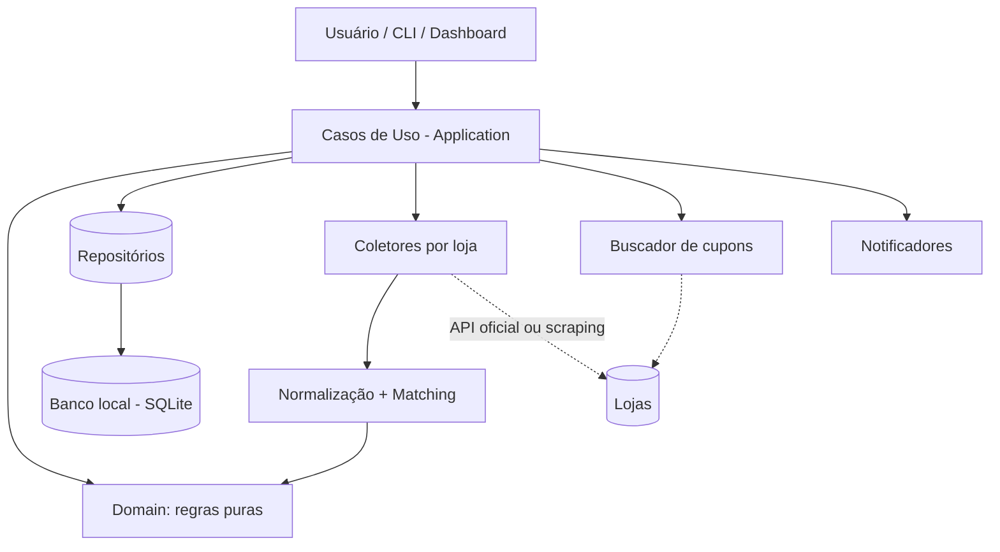
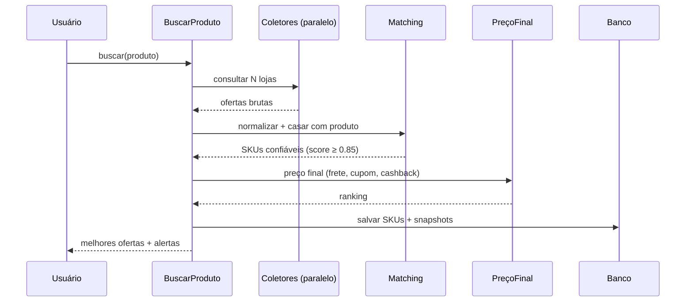
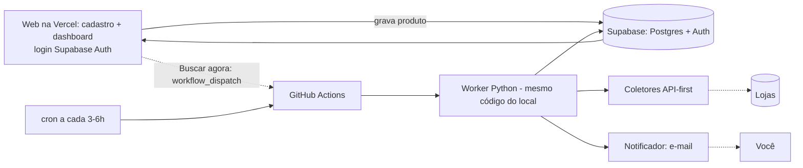
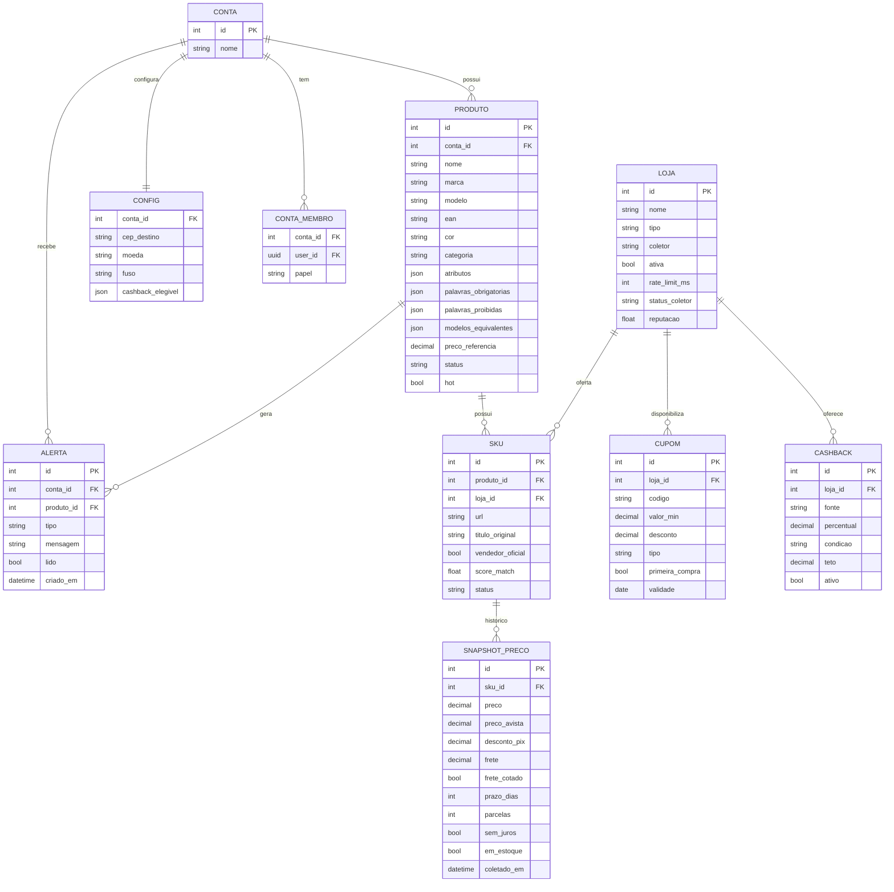
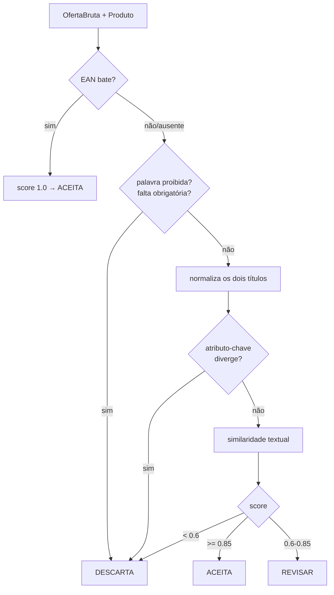

# Smart Price Tracker — Documento Mestre do Projeto (PRD)

> **O que é este arquivo:** documentação oficial + contexto para qualquer IA (Claude, ChatGPT, Gemini, etc.) + especificação funcional + guia de arquitetura.
> **Como usar:** em uma nova conversa com uma IA, anexe este arquivo e diga *"Este é o documento mestre do projeto. Siga as regras da seção 22."*
> **Versão do documento:** 1.7 · **Status:** Planejamento · **Uso:** Privado, 1 conta compartilhada (preparado p/ multiusuário) · **Execução:** local + nuvem (agendada via GitHub Actions), mesmo código.

---

## Índice

1. [Visão geral](#1-visão-geral)
2. [Objetivos](#2-objetivos)
3. [Fora do escopo](#3-fora-do-escopo-v1)
4. [Público-alvo](#4-público-alvo)
5. [Glossário](#5-glossário)
6. [Requisitos funcionais](#6-requisitos-funcionais)
7. [Requisitos não-funcionais](#7-requisitos-não-funcionais)
8. [Regras de negócio](#8-regras-de-negócio)
9. [Arquitetura](#9-arquitetura)
10. [Modelo de dados](#10-modelo-de-dados)
11. [Módulo: Produtos](#11-módulo-produtos)
12. [Módulo: Lojas](#12-módulo-lojas)
13. [Módulo: Busca e coleta](#13-módulo-busca-e-coleta)
14. [Módulo: Matching (normalização inteligente)](#14-módulo-matching-normalização-inteligente)
15. [Módulo: Cupons](#15-módulo-cupons)
16. [Módulo: Preço final e comparação](#16-módulo-preço-final-e-comparação)
17. [Módulo: Histórico e detecção de promoção falsa](#17-módulo-histórico-e-detecção-de-promoção-falsa)
18. [Módulo: Alertas](#18-módulo-alertas)
19. [Módulo: Dashboard e relatórios](#19-módulo-dashboard-e-relatórios)
20. [Camada de IA](#20-camada-de-ia)
21. [Tecnologias recomendadas](#21-tecnologias-recomendadas)
22. [Regras para IAs trabalharem no projeto](#22-regras-para-ias-trabalharem-no-projeto)
23. [Estratégia de testes](#23-estratégia-de-testes)
24. [Roadmap (V1 → V6)](#24-roadmap-v1--v6)
25. [Considerações legais e éticas](#25-considerações-legais-e-éticas)
26. [Estrutura de pastas](#26-estrutura-de-pastas)
27. [Segurança e qualidade de código](#27-segurança-e-qualidade-de-código)

---

## 1. Visão geral

O **Smart Price Tracker** é um sistema **pessoal e local** para **monitorar e comparar preços** de produtos em lojas online brasileiras confiáveis, buscar **cupons válidos**, calcular o **preço final real** (com frete e desconto), guardar **histórico de preços** e emitir **alertas** quando vale a pena comprar.

O diferencial não é só "comparar preço agora", mas responder à pergunta que importa:

> **"Onde e quando eu devo comprar este produto para gastar menos?"**

Isso envolve: identificar o mesmo produto entre lojas com títulos diferentes, considerar frete/prazo/pagamento, detectar promoção falsa (preço inflado antes do "desconto") e recomendar o melhor momento de compra.

**Execução local + nuvem:** o mesmo código roda no seu PC (desenvolvimento, buscas manuais) e na nuvem (GitHub Actions, agendado, sempre-ativo). Ambos gravam no mesmo banco (Supabase Postgres). Você cadastra produtos numa web, a pipeline agendada busca sozinha, e você acompanha de qualquer lugar.

---

## 2. Objetivos

| # | Objetivo | Prioridade |
|---|----------|------------|
| O1 | Cadastrar produtos com atributos obrigatórios e opcionais | Alta |
| O2 | Buscar o produto em várias lojas automaticamente | Alta |
| O3 | Identificar ofertas equivalentes mesmo com títulos diferentes | Alta |
| O4 | Buscar e validar cupons de desconto | Alta |
| O5 | Calcular o **preço final à vista** (preço à vista + frete − cupom − cashback) | Alta |
| O6 | Armazenar histórico de preços por loja | Alta |
| O7 | Emitir alertas (queda de preço, cupom novo, volta ao estoque) | Média |
| O8 | Gerar ranking das melhores ofertas | Média |
| O9 | Dashboard com gráficos de evolução | Média |
| O10 | Detectar promoção falsa e recomendar momento de compra | Baixa (V3+) |

**Métrica de sucesso pessoal:** economia acumulada real em R$ desde o início do uso.

---

## 3. Fora do escopo (V1)

- ❌ Produto público / marketplace para terceiros (uso privado — mesmo hospedado na nuvem)
- ❌ App mobile nativo (previsto para V5; a web é responsiva)
- ❌ Compra automática (o sistema **nunca** finaliza compras)
- ❌ Multiusuário **real** (listas separadas por pessoa) na V1/V2 — é **evolução futura**; o modelo já fica preparado (`conta_id`)
- ❌ Pagamentos dentro do sistema

> Nota: há **web e deploy na nuvem**, mas para **uso privado**. Hoje é **1 conta compartilhada** (você + noiva, mesma lista); o desenho permite escalar a múltiplas contas depois.

O sistema **informa e recomenda**; a decisão e a compra são sempre manuais.

---

## 4. Público-alvo

Uso privado: hoje **1 conta compartilhada** (você + sua noiva, mesma lista de produtos), com **login por pessoa** (Supabase Auth). Executado **localmente ou na nuvem** (mesmo código), acessível de qualquer lugar via web. A arquitetura deve **permitir escalar** para multiusuário real (contas separadas) e mobile sem reescrever tudo — por isso o gancho `conta_id`.

---

## 5. Glossário

| Termo | Significado |
|-------|-------------|
| **SKU** | Oferta específica de um produto numa loja (1 produto → N SKUs) |
| **GTIN/EAN** | Código de barras global do produto — melhor chave para matching |
| **Matching** | Processo de decidir se duas ofertas são o mesmo produto |
| **Preço final** | preço à vista do item + frete − cupom − cashback |
| **Preço à vista** | preço com desconto PIX/boleto; distinto do valor parcelado |
| **CEP destino** | CEP (config global) usado para cotar frete e prazo |
| **Coletor (scraper/API client)** | Componente que busca dados de uma loja |
| **Snapshot** | Registro de preço/frete de um SKU num instante |

---

## 6. Requisitos funcionais

**Produtos**
- RF01 — Cadastrar/editar/remover produto (via web) com atributos obrigatórios e opcionais.
- RF02 — Definir palavras obrigatórias, proibidas e modelos equivalentes.
- RF03 — Definir preço de referência (régua de alerta e base de economia; não filtra a busca).
- RF17 — Arquivar/reativar produto (arquivado não é coletado pela pipeline).

**Busca**
- RF04 — Buscar o produto em N lojas sob demanda ou agendado.
- RF05 — Normalizar títulos e casar ofertas com o produto cadastrado.
- RF06 — Registrar cada resultado como SKU + snapshot de preço.
- RF18 — Pipeline agendada (nuvem) lê **todos os produtos ativos** do banco e os processa.
- RF19 — "Buscar agora": disparar a pipeline manualmente ao cadastrar (sem esperar o ciclo).

**Cupons**
- RF07 — Buscar cupons por loja/categoria.
- RF08 — Registrar regras do cupom (validade, valor mínimo, primeira compra, meio de pagamento).
- RF09 — Aplicar cupom válido no cálculo do preço final.

**Comparação**
- RF10 — Calcular preço final por SKU e ranquear ofertas.
- RF11 — Comparar frete, prazo, parcelamento, reputação da loja.

**Histórico e alertas**
- RF12 — Guardar histórico de preços por SKU.
- RF13 — Detectar queda de preço, cupom novo, volta ao estoque.
- RF14 — Notificar o usuário (desktop/CLI/e-mail).

**Relatórios**
- RF15 — Dashboard com gráfico de evolução e ranking.
- RF16 — Economia acumulada e estatísticas (loja mais barata, etc.).

---

## 7. Requisitos não-funcionais

| Categoria | Requisito |
|-----------|-----------|
| **Paridade local/cloud** | Mesmo código roda local e na nuvem; só muda a **config por ambiente** (variáveis). Banco único (Supabase) nos dois. |
| **Sempre-ativo** | Coleta agendada roda na nuvem (GitHub Actions), independente do PC do usuário estar ligado. |
| **Modularidade** | Cada loja é um coletor plugável, sem tocar no núcleo. |
| **Resiliência** | Falha de uma loja não derruba a busca das demais. |
| **Idempotência** | Rodar a mesma busca 2x não duplica dados. |
| **Rastreabilidade** | Todo preço tem origem (URL + timestamp). |
| **Performance** | Coletas em paralelo, com rate-limit por loja. |
| **Testabilidade** | Núcleo isolado de rede/BD; coletores mockáveis. |
| **Portabilidade** | Núcleo agnóstico de UI (serve CLI, web e mobile). |
| **Durabilidade** | Backup/export do banco — o histórico de preços é o ativo mais valioso. |
| **Segurança** | Segredos fora do código; RLS por `conta_id`; dados de loja tratados como não-confiáveis. Ver seção 27. |
| **Qualidade** | Quality gate no CI (SonarCloud); 100% das regras cobertas + ~80% global. Ver seção 27. |

---

## 8. Regras de negócio

- **RN01** — Um produto tem 1..N SKUs (um por loja/vendedor).
- **RN02** — O preço final é `preço_item_à_vista + frete − desconto_cupom − cashback` e considera o **desconto à vista/PIX**. Nunca só o preço de vitrine.
- **RN03** — Cupom só entra no cálculo se **válido na data** e se atender ao **valor mínimo**.
- **RN04** — Só compara ofertas com matching **≥ 0.85**; **0.6–0.85** marca "revisar"; **< 0.6** descarta (ver seção 14).
- **RN05** — Prioriza **vendedor oficial** em marketplaces; sinaliza vendedores terceiros.
- **RN06** — Uma "promoção" só é considerada real se o preço atual estiver **abaixo da mediana dos últimos 30 dias**.
- **RN07** — O sistema **nunca compra** nem preenche checkout.
- **RN08** — Loja fora do ar → mantém último snapshot e marca `stale`.
- **RN09** — Frete/prazo só existem com **CEP destino** definido. Sem CEP: ranqueia só pelo preço do item e marca a oferta como **`frete_nao_cotado`** (não bloqueia a busca).
- **RN10** — Comparação padrão é pelo **preço à vista**. Parcelamento é informação secundária; **parcelado com juros nunca vence** um à vista mais barato.
- **RN11** — Só grava snapshot novo se **algo mudou** (preço, frete, estoque). Igual ao anterior → não duplica (mantém idempotência e histórico limpo).
- **RN12** — Dado suspeito de coletor (preço nulo/absurdo, variação implausível sem histórico) → marca `coletor_degradado`, **não grava** no histórico e gera alerta.
- **RN13** — Havendo vários cupons válidos numa loja, aplica **automaticamente o que resulta no menor preço final** e **lista os demais** (para você optar por outro que já tenha). Cupons não acumulam, salvo se a loja permitir explicitamente.
- **RN14** — Cashback só conta se você **atende à condição** (config `cashback_elegivel`; ex.: "cliente Inter"). Havendo várias taxas aplicáveis para a mesma loja, usa a **maior**, limitada ao `teto`. Mostra sempre a **fonte** (ex.: "10% via Banco Inter").
- **RN15** — A pipeline agendada processa **apenas produtos com status `ativo`**. Produto `arquivado` (ex.: já comprado) não é coletado, mas mantém o histórico.
- **RN16** — Todo dado "de usuário" (produto, config, alerta) pertence a uma **`conta_id`**; as queries **sempre filtram por conta**. Hoje há 1 conta fixa (você + noiva); virar multiusuário = a sessão de login definir a conta, sem mudar o schema.

---

## 9. Arquitetura

**Estilo:** Clean Architecture (núcleo isolado) + coletores plugáveis. SOLID no núcleo, pragmatismo nas bordas.

**Camadas:**

- **Domain** — entidades e regras puras (Produto, Oferta, Cupom, PreçoFinal). Sem dependência externa.
- **Application** — casos de uso (BuscarProduto, CompararOfertas, AvaliarCupom, GerarAlertas).
- **Adapters** — coletores por loja (API/scraper), repositórios (Supabase Postgres), notificadores.
- **Interface** — CLI + worker (V1), depois web (cadastro + dashboard) e API.

**Dois ambientes, um código (paridade local/cloud):** o mesmo worker roda em dois lugares, decidido só por **variáveis de ambiente**:

| Ambiente | Onde roda | Usado para |
|----------|-----------|------------|
| **Local** | seu PC (CLI/worker) | desenvolver, testar, rodar busca manual |
| **Nuvem** | GitHub Actions (cron + `workflow_dispatch`) | coleta agendada, sempre-ativa, e "Buscar agora" |

Ambos usam o **mesmo Supabase Postgres** (fonte única da verdade). Trocar de ambiente **não muda código** — muda o `.env` (local) / GitHub Secrets (nuvem). Isso só é possível porque a persistência está atrás do contrato **Repositório**.

**Web e acesso:** a web (cadastro + dashboard) fica na **Vercel** (Next.js/React), lê/grava no Supabase e dispara o "Buscar agora". O **login é via Supabase Auth** (você + noiva). Todo dado é escopado por **`conta_id`** (RN16): hoje 1 conta fixa; virar multiusuário é fazer a sessão definir a conta — sem mexer no schema. Vercel = a cara; GitHub Actions = o motor da coleta; Supabase = banco + auth.



**Fluxo principal (busca de um produto):**



**Topologia de execução (nuvem):**



Web grava o produto → cron (ou "Buscar agora") aciona o GitHub Actions → worker coleta e grava no Supabase → dashboard lê do Supabase. O mesmo worker roda local quando você quer.

### Contratos de borda (design)

O sistema tem **três contratos** que isolam o núcleo do mundo. O do **Coletor** está na seção 12; os outros dois:

**Repositório** — abstrai a persistência. O núcleo fala com interfaces (`RepositorioProduto`, `RepositorioSKU`, `RepositorioSnapshot`, `RepositorioCupom`, `RepositorioCashback`), com métodos **por intenção** (ex.: `produtos_ativos(conta)`, `ultimo_snapshot(sku)`, `salvar_snapshot_se_mudou(...)`). Regras:
- Núcleo depende da **interface**, nunca da implementação (Supabase). Trocar de banco = nova implementação, zero mudança no núcleo — é o que viabilizou local+cloud e SQLite→Supabase.
- **Todo acesso filtra por `conta_id`** (RN16): o repositório é onde o escopo por conta é aplicado no código; o **RLS é a segunda barreira** no banco (defesa em profundidade — seção 27).
- A **idempotência** (RN11) mora aqui: "salvar snapshot só se mudou".
- Testável com implementação **fake/in-memory** (seção 23).

**Notificador** — abstrai a saída de alertas: `enviar(alerta)`. Implementações: CLI, e-mail (SMTP), WhatsApp. Regras: falha de canal **não quebra a pipeline** (o alerta fica pendente/re-tentável); **não loga conteúdo sensível**; adicionar canal não toca na lógica de alerta.

> Os três contratos (Coletor, Repositório, Notificador) são o mesmo padrão: **o núcleo puro no meio, o mundo plugado por interface.** É isso que tornou barato cada "e se mudar" deste projeto.

---

## 10. Modelo de dados



**Banco: Supabase Postgres** (fonte única, local e nuvem). Relacional encaixa no modelo (joins para ranking, série histórica de snapshots). SQLite pode ser usado só para testes/experimentos offline — o contrato Repositório torna isso indiferente ao núcleo.

### Decisões de design do schema

Como este modelo vira tabelas (o **porquê** das escolhas — a migration só materializa isto):

- **Catálogo compartilhado vs dado de conta.** `LOJA`, `CUPOM` e `CASHBACK` são **catálogo** — iguais para todos, sem `conta_id` (a taxa de cashback do Inter é a mesma para qualquer pessoa; a *elegibilidade* é que é por conta, em `CONFIG`). Já `PRODUTO`, `CONFIG` e `ALERTA` são **por conta** (`conta_id`). `SKU` e `SNAPSHOT_PRECO` herdam a conta pelo `PRODUTO` (não repetem `conta_id`).
- **`CONTA_MEMBRO` no lugar de "membros json".** A ligação usuário↔conta é uma **tabela** (`conta_id` + `user_id` do Supabase Auth + `papel`), não um JSON. Motivo: o RLS precisa cruzar "o usuário logado pertence a esta conta?" de forma eficiente e indexável — JSON tornaria isso lento e frágil.
- **`CONFIG` é uma linha por conta** (`conta_id` como chave), não mais singleton — porque CEP, cashback elegível etc. passam a ser da conta.
- **Estratégia de RLS (seção 27, RN16):** dado de conta só é visível/editável por **membros da conta** (política cruza com `CONTA_MEMBRO`); catálogo é **leitura para qualquer logado**, escrita só pelo worker; o worker usa a `service_role`, que **ignora RLS** por ser confiável. `SKU`/`SNAPSHOT` aplicam a política via o `PRODUTO` pai.
- **Índices que importam:** `PRODUTO(conta_id, status)` — a pipeline lê "ativos" toda rodada; `SNAPSHOT_PRECO(sku_id, coletado_em)` — série temporal e "último preço"; FKs de `CUPOM`/`CASHBACK`/`SKU`; `CONTA_MEMBRO(user_id)` — usado em toda checagem de RLS.
- **Convenções:** dinheiro em `numeric` (nunca `float` — erro de arredondamento em preço é inaceitável); timestamps com fuso (`timestamptz`, base `America/Sao_Paulo`); campos de estado (`status`, `tipo`) validados por **constraint** (aceitam só os valores previstos); `conta_id`/FKs com **cascade** coerente (arquivar conta remove seus dados).
- **Dedupe (RN11) é regra de aplicação, não do banco:** o worker compara com o último snapshot e só insere se mudou — o banco não força isso, para manter o insert simples e rápido.

---

## 11. Módulo: Produtos

**Atributos obrigatórios:** nome, categoria.
**Recomendados:** marca, modelo, EAN/GTIN (a melhor chave de matching quando existe).
**Opcionais (campo `atributos` JSON):** cor, voltagem, tamanho, peso, memória, armazenamento, quantidade, observações.
**Controle de matching por produto:** `palavras_obrigatorias`, `palavras_proibidas`, `modelos_equivalentes`, `preco_referencia`.

**Atributos-chave por categoria:** cada categoria define quais atributos são **decisivos** para o matching — notebook: RAM, SSD, processador; TV: polegadas; geladeira: litros. O matching (seção 14) compara esses campos, não a descrição inteira. Na V1 isso é um mapa de configuração (categoria → atributos-chave), curado manualmente.

> Exemplo: para "Galaxy S25 Ultra 512GB", `palavras_obrigatorias = [512, ultra]`, `palavras_proibidas = [256, capa, película, seminovo]`; atributos-chave da categoria "celular" = `[armazenamento, cor]`.

---

## 12. Módulo: Lojas

Cada loja é um **coletor plugável** que implementa uma interface comum (`buscar(produto) -> Oferta[]`). Adicionar loja = adicionar um coletor, sem tocar no núcleo.

**Lista inicial:**

| Tipo | Lojas |
|------|-------|
| Marketplaces | Mercado Livre, Amazon, Shopee, Magalu |
| Varejo | Casas Bahia, Ponto, Fast Shop, Carrefour |
| Tech/Games | Kabum, Terabyte, Pichau |
| Casa | Leroy Merlin, Havan |

**Preferência de coleta:** API oficial > afiliados/feed > scraping (último recurso). Ver [seção 25](#25-considerações-legais-e-éticas).

**Reputação:** na V1 é um campo **manual por loja** (`reputacao`, nota 0–5 que você define). Fontes automáticas (reputação do Mercado Livre, Reclame Aqui) ficam para versões futuras — coletar reputação confiável é um problema à parte.

### Contrato do Coletor (design)

O Coletor é o **ponto de extensão** do sistema: adicionar uma loja = escrever um coletor novo que honra este contrato, **sem tocar no núcleo**. O contrato é o que permite ter N lojas sem o núcleo saber que elas existem.

**Responsabilidade única:** dada uma descrição de produto e um CEP, **buscar em UMA loja** e devolver ofertas **brutas**. Só isso — buscar e parsear. Nada além.

**A assinatura (notação de design, não implementação):**

```
Coletor:
  buscar(descricao: texto, cep: texto | vazio) -> lista[OfertaBruta]
  # metadados
  nome        # ex.: "Kabum"
  tipo        # marketplace | varejo | tech | casa
  fonte       # api | scrape   (API-first; scrape é último recurso)
  rate_limit  # pausa mínima entre chamadas
```

**OfertaBruta** (o que todo coletor devolve, ainda sem matching): `titulo`, `preco`, `preco_avista`, `desconto_pix`, `frete`, `frete_cotado`, `prazo_dias`, `parcelas`, `sem_juros`, `em_estoque`, `vendedor`, `vendedor_oficial`, `url`. "Bruta" = ainda não passou pelo matching nem pelo cálculo de preço final.

**Garantias que todo coletor honra (o contrato):**
- **Sem estado** — não guarda nada entre chamadas; o estado vive no banco. (Isso é o que deixa rodar igual local e no GitHub Actions.)
- **Falha isolada** — erro numa loja **nunca** derruba as outras: lança um erro tipado, o orquestrador segue com resultado parcial (RN08).
- **Vazio ≠ erro** — não achou o produto? Devolve lista vazia, não exceção.
- **Respeita `rate_limit` e timeout** — coleta educada (seção 25).
- **Frete depende de CEP** — sem CEP (ou loja que só cota no carrinho), devolve `frete_cotado = false` (RN09), não inventa frete.
- **Rastreabilidade** — toda oferta carrega a `url` de origem; o timestamp é posto pela pipeline.

**O que NÃO é função do Coletor (fronteiras):** matching, cálculo de preço final, aplicar cupom/cashback, decidir ranking, gravar no banco. Tudo isso é do núcleo/pipeline. Manter o coletor "burro" é o que o torna simples de escrever e **fácil de testar**.

**Taxonomia de erros (alimenta a resiliência):**
- `LojaIndisponivel` — falha transitória (timeout, 5xx) → retry com backoff.
- `ProdutoNaoEncontrado` — resultado vazio, **não** é erro.
- `ColetorQuebrado` — o parse falhou/veio absurdo (loja mudou o HTML) → marca `coletor_degradado`, não grava (RN12), e é o que o canary monitora (seção 23).

**Como se pluga:** cada coletor se registra implementando a interface base; o orquestrador (caso de uso `BuscarProduto`, seção 13) faz o fan-out para todas as lojas `ativa`s em paralelo. Adicionar/remover loja **não toca em nada** além do arquivo do coletor.

**Testabilidade (seção 23):** como o coletor só recebe entradas e devolve `OfertaBruta` (sem persistir nem decidir nada), ele é testado contra **HTML/JSON gravados** (fixtures) — o parsing é validado sem bater na loja real.

---

## 13. Módulo: Busca e coleta

**Modo da V1 — Descoberta por busca (por descrição, não por URL).** Você informa a descrição completa do produto e o sistema busca sozinho nas lojas. Ex.: *"Notebook ASUS Vivobook 15 M1502, AMD Ryzen 7, 8 GB RAM, 512 GB SSD, KeepOS Linux, Cool Silver - M1502YA-NJ611"*. Dessa string saem o texto de busca e os atributos-chave que o matching (seção 14) usa pra filtrar.

> Nota realista: não existe "buscar em toda a internet" de forma literal. Na prática, cada **coletor faz a busca na sua própria loja** (endpoint de search da loja); opcionalmente um **agregador** (ex.: Google Shopping) pode servir de fonte extra de descoberta. Quanto mais aberta a busca, mais o **matching** (seção 14) vira crítico — é ele que separa o produto certo do lixo.

- Coletores rodam **em paralelo** com **rate-limit por loja** e timeout.
- Cada coletor devolve `Oferta` bruta (título, preço, preço à vista, frete, prazo, parcelas, url, estoque, vendedor).
- **Frete/prazo** dependem do **CEP destino** (config). Sem CEP, não cota frete e marca `frete_nao_cotado` (RN09).
- **Onde/quando roda:** na nuvem, via **GitHub Actions** — `cron` a cada **3–6h** (produtos `hot` podem rodar de hora em hora) lendo **produtos ativos** (RN15), e **`workflow_dispatch`** para o "Buscar agora" ao cadastrar (RF19). O mesmo worker roda local sob demanda.
- **Cron é "melhor esforço":** o agendamento do Actions pode atrasar/pular sob carga — aceitável para preço. Workflow agendado pausa após ~60 dias sem commit no repo (reativar com um commit).
- **Deduplicação:** só grava snapshot se algo mudou vs. o último (RN11) — histórico não incha com dados idênticos.
- **Coletor quebrado (site mudou):** valida sanidade do dado antes de gravar; suspeito → `coletor_degradado`, não grava, alerta (RN12).
- Falha isolada: uma loja com erro não interrompe as outras (resultado parcial + log).
- Retry com backoff; respeita `robots.txt` e ToS.
- Toda oferta guarda **origem (URL) e timestamp** (rastreabilidade).

### Caso de uso: BuscarProduto (orquestração)

O maestro operacional: pega UM produto e coordena todos os passos até o resultado gravado. Vive na camada **Application** — **orquestra, não contém regra** (as regras estão no Domain). O diagrama de sequência está na seção 9; aqui o design em passos:

1. **Carrega contexto:** o produto + a `CONFIG` da conta (CEP destino, cashback elegível).
2. **Fan-out:** dispara todos os coletores de lojas `ativa`s **em paralelo** (async), cada um com seu rate-limit e timeout.
3. **Coleta resiliente:** coletor que falha não derruba os outros — resultado parcial + log; `ColetorQuebrado` marca `coletor_degradado` e não grava (RN08, RN12).
4. **Matching:** cada `OfertaBruta` passa pelo matcher (seção 14) → aceita (≥0.85) entra; "revisar" entra na fila; descarta é ignorada. Como uma loja devolve **vários anúncios** do mesmo produto, escolhe-se a **melhor oferta por loja** (em estoque, menor preço final) para virar/atualizar o `SKU` único daquela loja (RN01).
5. **Preço final:** calcula por SKU (seção 16) com cupons/cashback do catálogo e da config.
6. **Persistência idempotente:** grava/atualiza SKU; snapshot **só se mudou** (RN11). Rodar 2x = mesmo estado.
7. **Alertas:** compara com o estado anterior e dispara o que couber via Notificador (seção 18).
8. **Devolve** o ranking (CLI/web) e registra a rodada.

**Propriedades garantidas:** idempotente (RN11), resiliente por loja (RN08), escopado por conta (RN15/RN16), e **sem estado no worker** (tudo que persiste vai pro Supabase) — é o que faz rodar igual local e no GitHub Actions.

**Dois gatilhos, um caso de uso:** agendado (cron → **todos** os ativos) e sob demanda ("Buscar agora" → **um** produto). Mesma lógica, entradas diferentes.

---

## 14. Módulo: Matching (normalização inteligente)

**O coração do sistema.** Decide se "Samsung Galaxy S25 Ultra 512GB Preto" e "Galaxy S25 Ultra Black 512 GB" são o mesmo produto. Como a busca é por descrição (seção 13), os resultados chegam cheios de ruído — e é o matching que separa o produto certo do lixo.

**Por que é o componente mais crítico:** ele erra de dois jeitos, e os dois envenenam tudo que vem depois —
- **Falso positivo** (o pior): casa produtos diferentes (8GB tratado como 16GB, seminovo como novo) → você compara e é alertado sobre um **preço que não é do seu produto**. Dado errado que *parece* certo.
- **Falso negativo:** perde uma oferta real (título muito diferente) → você deixa de ver o melhor preço.

Preço, ranking, alerta e histórico **confiam** no matching. Por isso ele é o mais bem projetado e o mais testado.

**O desenho: um pipeline de "portões" e "pontuadores".** Sinais fortes e baratos primeiro (curto-circuito); pontuação difusa só para o que sobrar ambíguo.



**Etapas (do mais forte ao mais fraco):**
1. **EAN/GTIN — portão forte.** Se ambos têm EAN e batem, é match certo (score 1.0), fim. Melhor chave que existe; quando presente, dispensa o resto.
2. **Regras do produto — portões de veto.** `palavras_proibidas` rejeitam na hora ("seminovo", "capa"); `palavras_obrigatorias` exigem presença ("512", "ultra"). Baratos, rodam cedo, cortam a maior parte do lixo.
3. **Normalização.** Canoniza os dois títulos: minúsculas, sem acento, unifica unidades (`512 gb`→`512gb`), traduz cores (`black`→`preto`), remove ruído ("frete grátis", "12x sem juros"). Saída: texto comparável.
4. **Atributos-chave por categoria.** Extrai do título os atributos decisivos da categoria (notebook: RAM/SSD; TV: polegadas — seção 11) e compara com o produto cadastrado. Atributo-chave divergente = sinal forte de "produto diferente".
5. **Similaridade textual — pontuador.** Compara o texto normalizado (ex.: token-set ratio) para o que restou ambíguo.
6. **Score final ∈ [0,1]** → **≥ 0.85 aceita · 0.6–0.85 revisar · < 0.6 descarta** (RN04).

**Os três destinos:**
- **Aceita** → entra na comparação/ranking.
- **Revisar** → segura para sua confirmação; sua resposta vira rótulo no dataset (abaixo).
- **Descarta** → fora.

**Decisões de design:**
- **Determinístico e explicável primeiro (V1); IA depois.** Uma heurística que você **depura** ("rejeitou porque faltou '512'") vale mais que uma caixa-preta. A IA (embeddings/LLM) entra como plug-in só na zona "revisar", atrás do **mesmo contrato** (par → score), sem reescrever o resto (seção 20).
- **Camadas do mais forte/barato ao mais fraco/caro.** Curto-circuito: EAN encerra; palavra proibida rejeita. Só o ambíguo chega ao pontuador caro — rápido no caso comum.
- **Explicabilidade é requisito.** O matcher devolve **por que** decidiu (qual etapa, qual score) — essencial para a fila "revisar" e para depurar.
- **Dicionários e limiares são config, não código.** Traduções de cor, sinônimos de unidade, palavras-ruído, thresholds e pesos ficam em configuração; você afina sem recompilar.
- **Puro, sem I/O.** Vive no núcleo (Domain), testável isolado, etapa por etapa (seção 23).

**O dataset rotulado é um ativo de primeira classe.** Pares "é / não é o mesmo produto" (Vivobook 8GB ≠ 16GB) formam o teste de regressão do matcher. Cada erro real que você corrige na fila "revisar" **vira um caso novo** — o matcher melhora sem regredir. É o que protege o coração do sistema ao longo do tempo (seção 23).

---

## 15. Módulo: Cupons

O sistema **busca os cupons de cada loja** e os apresenta por loja/produto (ex.: *Casas Bahia → `CELULAR2025` −10%*). Não basta achar o código — precisa **validar**. Cada cupom guarda: `codigo`, `desconto` (valor ou %), `valor_min`, `validade`, `primeira_compra`, `tipo` (PIX/cartão/frete), categorias aceitas.

**Regras:**
- Só aplica no cálculo se **válido na data** e se o subtotal atende ao **valor mínimo** (RN03).
- Havendo vários válidos, aplica o **melhor automaticamente** e **lista os outros** (RN13).
- O preço exibido na comparação já é o **preço final com o melhor cupom aplicado**, mostrando qual código foi usado.

---

## 16. Módulo: Preço final e comparação

```
preço_final = preço_item_à_vista + frete − desconto_cupom − cashback
```

O **ranking usa o preço final à vista**, não o preço de vitrine (RN02, RN10). Notas:
- **Frete** entra só se cotado (exige CEP destino, RN09); sem CEP, compara sem frete e sinaliza.
- **Parcelamento** é informação secundária: exibido, mas parcelado com juros nunca vence um à vista mais barato.
- **Cashback** vem de **fonte externa à loja** (Méliuz, AME, banco). Cada registro é `loja + fonte + percentual + condição + teto` (entidade CASHBACK). A **condição** captura o "cliente vs não-cliente" (ex.: *Casas Bahia via Banco Inter: 10% se cliente Inter, 5% se não*). O sistema usa só a taxa cuja condição você atende (`cashback_elegivel` na config) e, havendo várias, a **maior aplicável**; respeita o `teto`. Não configurado → entra como zero. Coleta automática de cashback fica para versões futuras.

**Ordem de cálculo (design — a ordem importa):** para cada SKU —
1. **Base** = preço à vista (com desconto PIX/boleto, se houver); senão, o preço normal.
2. **Cupom** sobre a base → `pós_cupom = base − desconto_cupom` (melhor cupom válido, `valor_min` medido sobre a base — RN03, RN13).
3. **Cashback** sobre o `pós_cupom` (valor efetivamente pago), limitado ao `teto` (RN14). *Decisão: cashback incide sobre o produto pós-cupom, não sobre o frete.*
4. **Frete** somado, se cotado (RN09).
5. `preço_final = pós_cupom + frete − cashback`.

> Nota de modelagem: o cashback é dinheiro **recebido depois**, não desconto no checkout. O ranking usa o **custo líquido efetivo** (descontando o cashback) — é a comparação justa, mas fica explícito que não é abatimento imediato.

Critérios e pesos (configuráveis):

| Critério | Peso padrão |
|----------|-------------|
| Preço final à vista | Alto |
| Frete | Alto |
| Cupom | Alto |
| Loja oficial | Alto |
| Reputação | Alto |
| Prazo de entrega | Médio |
| Cashback | Médio |
| Parcelamento (info) | Opcional |

---

## 17. Módulo: Histórico e detecção de promoção falsa

- Cada **mudança** de preço/frete/estoque gera um `SNAPSHOT_PRECO` (RN11) → série temporal por SKU sem duplicar dados idênticos.
- **Promoção real (RN06):** preço atual < mediana dos últimos 30 dias.
- **Promoção falsa:** preço inflado e depois "descontado" para um valor ≥ mediana → sinaliza `promo_suspeita`.
- Base para gráficos de evolução e para a recomendação de "melhor momento".

---

## 18. Módulo: Alertas

Tipos: `queda_preco`, `cupom_novo`, `volta_estoque`, `promo_relampago`, `promo_suspeita`.

**Quando cada um dispara (design — comparando a rodada atual com o estado anterior):**
- `queda_preco` — preço final à vista **≤ preço de referência** OU caiu **≥ X%** vs. o último; idealmente **abaixo da mediana de 30 dias** (RN06) para ser queda "real".
- `cupom_novo` — surgiu cupom válido que **reduz** o preço final de um produto ativo.
- `volta_estoque` — `em_estoque` passou de `false` → `true`.
- `promo_relampago` — queda brusca (**≥ Y%**) num intervalo curto.
- `promo_suspeita` — o "desconto" ainda está **≥ mediana de 30 dias** (RN06): alerta de **cilada**, não de oportunidade.

**Anti-spam (design):** enquanto a condição persiste, **não repetir** o mesmo alerta a cada rodada — só dispara na **transição** (dedupe de alerta). Todo alerta pertence à conta (RN16).

Os alertas são disparados pelo **worker** ao fim de cada rodada (local ou GitHub Actions). Canais (V1): CLI / notificação desktop. Na nuvem o canal garantido é **e-mail** (SMTP); depois **WhatsApp**.

> Nota de viabilidade: e-mail é simples (SMTP). WhatsApp **não tem API aberta gratuita** — exige a **WhatsApp Business API** (Meta/provedor, geralmente pago) ou bibliotecas não-oficiais que violam os ToS. Para uso pessoal, avaliar custo/risco; e-mail é o canal garantido da V2.

---

## 19. Módulo: Dashboard e relatórios

- **Comparação por loja** (a "aba"): para cada loja mostra `preço original → cupom aplicado (código) → cashback (fonte) → preço final à vista`, ordenado do menor preço final. Ex.: *Casas Bahia R$2.000 → `CELULAR2025` (−10%) → +10% cashback via Banco Inter → R$1.620*. Exibe também as opções não aplicadas (outros cupons/cashbacks) para você conferir.
- Gráfico de evolução de preço por produto (com marcação de cupons/alertas).
- Ranking atual das melhores ofertas.
- **Economia acumulada** (soma das diferenças entre o preço de referência e o preço final à vista efetivamente encontrado).
- Estatísticas: loja mais barata, mais rápida, com melhores cupons; produtos mais pesquisados; preço médio.

---

## 20. Camada de IA

Opcional e **plugável** — o sistema funciona sem IA (heurística). A IA entra para melhorar, não como dependência.

| Uso | O que faz | Versão |
|-----|-----------|--------|
| Matching difícil | Embeddings de título p/ casos que a heurística não resolve | V3 |
| Promoção falsa (IA) | Classifica padrão suspeito no histórico (além da heurística RN06, já ativa antes) | V4 |
| Melhor momento | Estima janela de compra (Black Friday, etc.) | V4 |
| Aprendizado de preferência | Prioriza lojas que você costuma comprar | V4 |

> Se usar a API da Anthropic, consulte a skill **claude-api** para IDs de modelo e boas práticas antes de escrever o código.

---

## 21. Tecnologias recomendadas

| Camada | Sugestão | Alternativa |
|--------|----------|-------------|
| Linguagem | **Python 3.12** (worker) | Node/TypeScript |
| Coleta | `httpx` (async) + `selectolax`/`BeautifulSoup`; `Playwright` só quando JS for necessário | requests + lxml |
| Banco | **Supabase Postgres** (local + nuvem) | SQLite só p/ testes offline |
| Acesso ao banco | SQLAlchemy + Alembic (ou client `supabase-py`) | Peewee |
| Agendamento | **GitHub Actions** (`cron` + `workflow_dispatch`) | APScheduler (modo local) |
| CLI | Typer + Rich | Click |
| Web (cadastro + dashboard) | Next.js/React na **Vercel** | Streamlit (protótipo rápido) |
| Login/Auth | **Supabase Auth** (você + noiva; escopo por `conta_id`) | — |
| Notificação | e-mail via SMTP | WhatsApp (Business API) |
| Segredos | `.env` (local) / **GitHub Secrets** (nuvem) | — |
| Testes | pytest + respx (mock HTTP) | — |

> Python no worker pela força de scraping/data/IA. A web pode ser em JS/React sem afetar o worker — comunicam-se pelo Supabase.

---

## 22. Regras para IAs trabalharem no projeto

Ao pedir para uma IA desenvolver, exija:

1. **Respeite a arquitetura** (seção 9): núcleo (Domain/Application) não importa rede, BD nem framework de UI.
2. **Coletores são plugáveis** e implementam a mesma interface; nunca acople loja ao núcleo.
3. **Nada de compra automática** (RN07).
4. **Todo preço rastreável** (URL + timestamp).
5. **Preço final ≠ preço de vitrine** (RN02) — sempre incluir frete/cupom/cashback.
6. **Escreva testes** para regras de negócio e matching (seção 23).
7. **Idempotência**: rodar de novo não duplica dados.
8. **Comece pequeno**: entregue a fatia vertical da V1 antes de generalizar.
9. **Sem segredo hardcoded**; use `.env`.
10. **Respeite ToS/robots.txt** de cada loja (seção 25).

---

## 23. Estratégia de testes

**Formato: pirâmide** — muitos unitários, alguns de componente, E2E focado nos fluxos. Cada teste vive na **camada mais barata** que consegue prová-lo (borda desce; fluxo sobe). Evitar o "cone de sorvete" (E2E demais → lento, frágil, ignorado).

### Unitários (base — worker Python, regras puras, sem rede/BD)
Cobrir 100% das regras (RN01–RN16): preço final à vista (RN02), cupom válido/mínimo (RN03) e **melhor cupom** (RN13), cashback elegível/teto (RN14), promoção real×falsa (RN06), dedupe de snapshot (RN11). **Matching:** cada etapa isolada (normalização, palavras proibidas/obrigatórias, similaridade, atributos-chave por categoria).

### Componente / integração (meio)
- **Coletores:** contra HTML/JSON **gravados** (fixtures/`respx`), nunca a loja ao vivo; pega layout quebrado (RN12).
- **Repositórios:** contra Postgres de teste (container); **testa isolamento por `conta_id`** (RN16) — é teste de **segurança**, não só de dados.
- **Casos de uso:** BuscarProduto com **coletores fake**; valida fan-out paralelo, resiliência (RN08), dedupe.
- **Web (componentes):** formulário de cadastro e **aba de comparação** (`preço → cupom → cashback → final`) com dados mockados (React Testing Library).

### E2E (topo — Playwright, coletores fake, nunca loja real)
Cobre **os fluxos de usuário de forma abrangente** (login → cadastro → Buscar agora → comparação → arquivar → alerta) — mas **casos de borda descem a pirâmide** (viram componente/unitário, mais rápidos e estáveis). Também o fluxo da pipeline: cron → worker lê ativos → coleta fake → grava → alerta.

### Regras de ouro
1. **Nunca bater em loja real** em teste (ToS, lentidão, flakiness) — fixtures/fakes.
2. **Dataset rotulado de matching** (pares "é/não é o mesmo produto") = ativo de teste mais valioso; cresce a cada erro real → regressão que protege o coração do sistema.
3. **Testar isolamento entre contas** (`conta_id`).
4. Dados **determinísticos** (factories/fixtures).

### Canary (monitoramento, não teste de PR)
Workflow **agendado e não-bloqueante** bate ocasionalmente nas lojas reais só para avisar quando um coletor quebra (loja mudou o HTML). Complementa o RN12 (detecção em runtime). **Não reprova build.**

### CI
**GitHub Actions** roda unitário + componente + E2E a cada PR/push (trava merge se quebrar); o canary roda em schedule à parte.

**Meta:** 100% das regras de negócio (seção 8) por unitário; fluxos de usuário por E2E.

---

## 24. Roadmap (V1 → V6)

| Versão | Entrega |
|--------|---------|
| **V1 — Núcleo (local) + Supabase** | Worker Python + Supabase Postgres, cadastro via CLI, CEP destino, 2–3 coletores, matching heurístico, preço final à vista (frete por CEP + PIX), histórico. |
| **V2 — Nuvem + web** | GitHub Actions agendado + "Buscar agora", web (cadastro + dashboard), cupons, alertas por e-mail. |
| **V3 — Analítico + IA leve** | Gráficos de evolução, ranking, economia acumulada, IA de matching difícil. |
| **V4 — Inteligência** | Melhor momento de compra, promoção falsa (IA), aprendizado de preferência. |
| **V5 — Mobile** | App mobile consumindo o mesmo Supabase/API. |
| **V6 — Multiusuário** | Contas separadas + convites: a sessão define a `conta_id` (gancho já existe desde a V1). |

**Primeira fatia (fazer já):** 1 produto → 1 coletor → matching → preço final à vista → gravar no Supabase → mostrar no CLI. Rodando local. Depois generaliza e sobe pra nuvem.

### Visão de produto: 3 papéis

A evolução não é só "mais features" — é o produto **mudar de papel**. Isso guia a priorização: o que aproxima do "Conselheiro" é alto valor; o resto é polimento.

| Fase | Pergunta que responde | Papel |
|------|----------------------|-------|
| **V1** | "Onde está mais barato agora?" | **Comparador** |
| **V2** | "Algo que eu quero ficou bom?" | **Vigia** (monitora sozinho, avisa) |
| **V3+** | "Devo comprar agora ou esperar?" | **Conselheiro** (recomenda a decisão) |

### Ideias futuras (não priorizadas)

- **Lista de desejos comparada** — vários produtos monitorados num painel de "melhores oportunidades agora". *(papel Vigia)*
- **Orçamento / meta mensal** — "gastar até R$ X neste mês"; o sistema prioriza a melhor combinação. *(papel Conselheiro)*
- **Alertas ricos** — e-mail/WhatsApp com gráfico e motivo ("caiu 18%, abaixo da mediana de 30d"). *(estende V2)*
- **Sazonalidade** — usar o histórico p/ prever a melhor época ("Black Friday costuma ser ~12% menor"). *(papel Conselheiro, liga com V4)*
- **Export/backup automático** do histórico.

---

## 25. Considerações legais e éticas

Ponto que o planejamento original não tratou e é importante:

- **Prefira APIs oficiais / programas de afiliados** (Mercado Livre, Amazon e Magalu têm APIs). Scraping é o último recurso.
- **Respeite `robots.txt` e os Termos de Uso** de cada loja — vários proíbem scraping automatizado.
- Use **rate-limit educado** e identifique o User-Agent; evite carga que pareça abuso.
- Uso **pessoal e privado** reduz risco, mas não anula os ToS. Não redistribua dados coletados.
- Não contorne proteções anti-bot de forma agressiva — se uma loja bloqueia, respeite e desative o coletor.
- **IP de datacenter apanha mais:** rodando na nuvem (GitHub Actions usa faixas Azure), lojas bloqueiam/captcham com mais facilidade. Reforça a regra **API-first**; scraping pesado é melhor testar/rodar local.

> Resumo: construa como quem respeita a fonte. Isso também deixa o sistema mais estável.

---

## 26. Estrutura de pastas

```
smart-price-tracker/
├── SMART-PRICE-TRACKER.md        # este documento (fonte da verdade)
├── README.md                     # como rodar (local e nuvem)
├── pyproject.toml
├── .env.example                  # config local (Supabase, SMTP...)
├── .github/
│   └── workflows/
│       ├── coleta-agendada.yml   # cron 3-6h → roda o worker
│       ├── buscar-agora.yml      # workflow_dispatch (acionado pela web)
│       ├── ci.yml                # testes a cada PR/push (unit + componente + e2e)
│       └── canary.yml            # schedule não-bloqueante: layout das lojas mudou?
├── src/                          # WORKER (Python) — mesmo código local/nuvem
│   ├── domain/                   # entidades + regras puras (sem I/O)
│   │   ├── produto.py
│   │   ├── oferta.py
│   │   ├── cupom.py
│   │   ├── preco_final.py
│   │   └── matching/             # matcher determinístico e explicável (§14 é puro)
│   ├── application/              # casos de uso + PORTAS (contratos)
│   │   ├── coletores.py          # porta Coletor + erros tipados (o núcleo define, o adaptador implementa)
│   │   ├── buscar_produto.py
│   │   ├── comparar_ofertas.py
│   │   ├── avaliar_cupom.py
│   │   └── gerar_alertas.py
│   ├── adapters/
│   │   ├── coletores/            # 1 arquivo por loja (plugável); a porta Coletor fica no núcleo (application/coletores.py)
│   │   │   ├── mercado_livre.py
│   │   │   └── kabum.py
│   │   ├── matching/             # plug-in de IA p/ o matching (V2+); heurística pura fica em domain/matching/
│   │   ├── repositorios/         # Supabase Postgres (contrato Repositório)
│   │   └── notificadores/        # e-mail SMTP
│   ├── interface/
│   │   ├── cli.py                # rodar/buscar local
│   │   └── worker.py             # entrypoint da pipeline (local e Actions)
│   └── config.py                 # lê env (.env local / GitHub Secrets)
├── web/                          # cadastro + dashboard (Next.js/React) → lê Supabase
├── supabase/
│   └── migrations/               # schema versionado
├── tests/                        # testes do worker (Python)
│   ├── unit/                     # domain + matching (regras puras)
│   ├── componente/               # coletores (fixtures), repositórios (conta_id), casos de uso
│   ├── e2e/                      # fluxos ponta-a-ponta (Playwright) c/ coletores fake
│   ├── canary/                   # bate em loja real (rodado só pelo canary.yml)
│   ├── fixtures/                 # HTML/JSON gravados das lojas
│   └── matching_dataset/         # pares rotulados "é/não é o mesmo produto"
└── docs/                         # diagramas extras, ADRs
```

---

## 27. Segurança e qualidade de código

### Segredos (chaves, senhas)
- **Segredo nunca no código/git.** Cofres: `.env` local (no `.gitignore`) · **GitHub Secrets** (Actions) · **Vercel Env Vars** (web).
- **Supabase — as duas chaves:** `anon key` (pública, pode ir no frontend, protegida por RLS) vs `service_role key` (**secreta**, só backend/worker, **ignora o RLS** → nunca no frontend).
- **Secret scanning:** GitHub push protection + `gitleaks` no pre-commit. **Nunca logar** segredo (nem em stack trace).

### Dados
- **RLS ligado** no Supabase com políticas por **`conta_id`** (RN16): o isolamento é garantido **no banco**, não só no código. Coberto por teste de isolamento (seção 23) — é segurança, não só dados.
- **Trânsito:** HTTPS em tudo (Vercel/Supabase). **Repouso:** Supabase criptografa.
- **Dados pessoais** (e-mail do login, CEP) sob **LGPD**: minimizar, não logar, não expor. Backup do histórico (NFR Durabilidade).

### Aplicação
- **Dados de loja são NÃO-confiáveis** → escapar antes de renderizar (evita XSS); cuidado com `dangerouslySetInnerHTML`.
- Validar entradas do cadastro; **queries parametrizadas** (ORM/client) — nunca SQL concatenado.
- **"Buscar agora" autenticado** (senão spam queima seus minutos de Actions). Token do GitHub só como secret no backend, nunca no frontend.
- **Dependências:** Dependabot + `pip-audit`/`npm audit` (CVEs / supply chain).

### CI/CD
- `GITHUB_TOKEN` com **permissão mínima**; actions **fixadas por SHA** (não `@main`); segredos fora dos logs.
- **Branch protection:** CI verde + revisão antes de merge na `main`.

### Qualidade de código (SonarCloud + gate no CI)
- **SonarCloud** integrado ao GitHub Actions; o **quality gate trava o merge** se reprovar.
- **Cobertura: 100% nas regras de domínio (RN01–RN16) + ~80% global**, com foco em "código novo".
- Gate também: **0 vulnerabilidades/bugs novos**, **0 security hotspots** não revisados, duplicação baixa.
- **Lint/tipo/segurança:** Python → `ruff` + `mypy` + **`bandit`**; Web → ESLint + **TypeScript strict**.
- Cobertura é **piso, não troféu**: cobrir a **lógica** (regras), não getters triviais.

---

*Fim do documento mestre. Mantenha-o como fonte da verdade: mudou o projeto, atualize aqui.*
